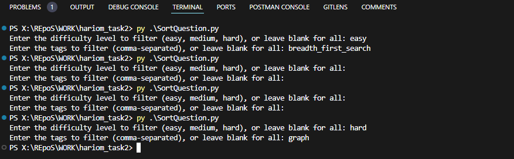

# hariom_task2

### 2. Intermediate Task: JSON Data Handling and Processing (Medium)

#### Objective: Write a Python script to process data from a JSON file containing mock interview questions and answers. 

Details:
- Read data from a JSON file that contains various fields such as question, answer,
difficulty_level, and tags.
- Filter questions based on difficulty level or tags.
- Format the filtered questions into a new JSON structure and save it to a new file.
- Include error handling and logging for the processing steps.

JSON data, and handle exceptions properly.

Script Break Down

- ### Filtered On basis of 
  - easy
  - medium
  - hard
  - and all other variations of tag
-

- ### Functions Script
  -   The main function reads questions from a JSON file, filters them based on difficulty level and tags, groups them by attributes, and saves the grouped questions to a new JSON file.

  - The function `group_questions_by_attributes` categorizes a list of questions based on their
    difficulty level and tags into different groups.

    @questions: It looks like you are trying to group a list of questions based on their
attributes such as difficulty level and tags. The function `group_questions_by_attributes` takes a
    list of questions as input and categorizes them into different groups based on their difficultylevel and tags

    @return: The function `group_questions_by_attributes` returns a dictionary where questions aregrouped based on their difficulty level and tags. The keys in the dictionary represent different
    attributes such as difficulty level ('hard', 'medium', 'easy') and tags ('graph', 'two_pointer','sorting', 'string', 'array', 'dynamic_programming', 'breadth_first_search', 'sliding_window', 'hash)

  - The function `filter_questions` filters a list of questions based on specified difficulty level and
    tags.

    @questions: The `questions` parameter is a list of dictionaries, where each dictionary
    represents a question. Each question dictionary likely contains information such as the question
    text, difficulty level, and tags associated with the question

    @difficulty_level: The `difficulty_level` parameter in the `filter_questions` function is used
    to filter questions based on their difficulty level. If a difficulty level is provided, only
    questions with that specific difficulty level will be included in the filtered list. If no
    difficulty level is provided (i.e., `None`),

    @tags: The `tags` parameter in the `filter_questions` function is used to filter questions
    based on specific tags. It allows you to specify one or more tags, and only questions that have at
    least one of the specified tags will be included in the filtered result

    @return: The function `filter_questions` returns a list of questions that match the specified
    difficulty level and tags criteria. If no criteria are specified (difficulty level and tags are both None), all questions are returned.

